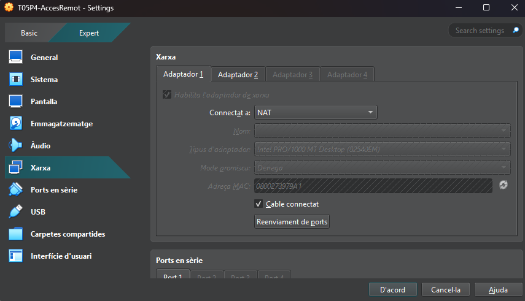
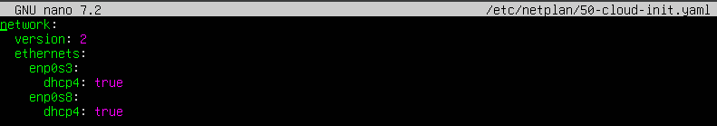
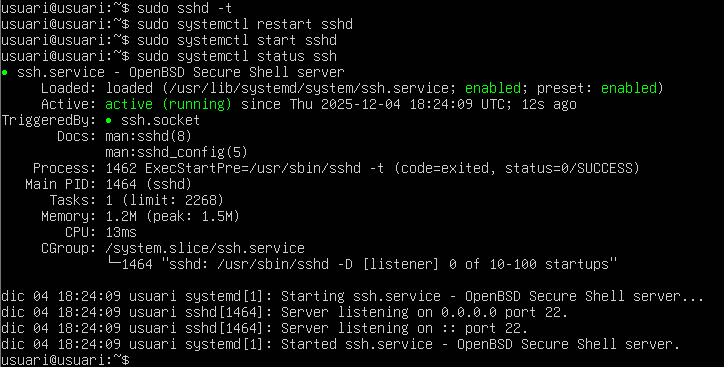
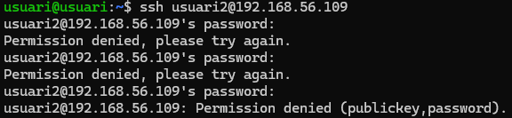
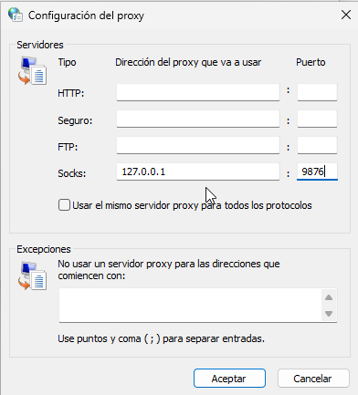
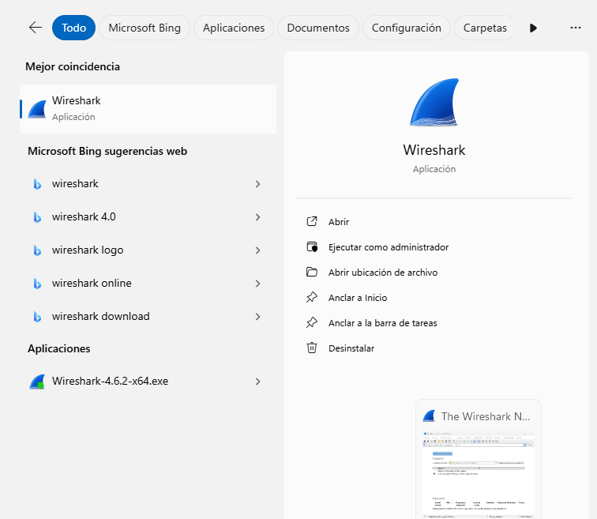
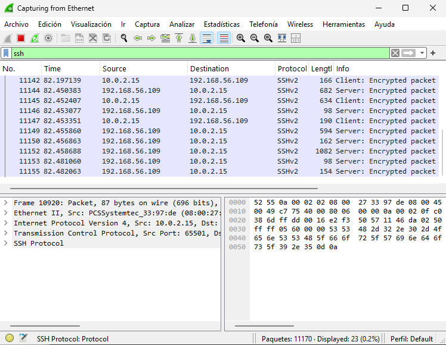

# T05 - Accés Remot
## Edu Gordo Cebrià

Els dos adaptadors que utilitzarem estaran en “NAT”

---

I el segon adaptador el deixarem en “amfitrió”

---

Instal·lem el paquet de SSH en el servidor d’ubuntu

---

Configurem els dos adaptadors i els activem perquè funcionin com els hem configurat en el principi

---

Apliquem els canvis amb “sudo netplan apply” i fem un “ip a” per veure si els adaptadors “enp0s8” té la IP que necessitem per connectar-nos.

---

Editem l’arxiu “sudo nano /etc/ssh/sshd.config” i activarem les opcions de “PermitRootLogin prohibit-password” i la linea de “StrictModes yes”. A més, Afegim la linia “AllowUsers usuari”

---

Seguidament, fem “sudo sshd -t” per veure que l’arxiu està creat correctament i després reiniciarem el sistema ssh i el tornarem a iniciar per si un cas amb les comandes “sudo systemctl restart sshd” i “sudo systemctl start sshd”. Per últim, confirmarem que el servei està funcionant correctament amb “sudo systemctl status sshd”

---

Crearem l’usuari2 amb la comanda “sudo adduser usuari2” i farem que no es pugui connectar a ssh

---

Per comprovar-ho, ho intentarem fer a la terminal. i podem veure que no es pot connectar, ja que encara que la contrasenya la posem correcta els tres intents seguits, el servei no ens deixarà connectarnos amb aquest usuari que hem creat

---

Després, a la terminal escribim la comanda “ssh -D 9876 usuari@192.168.56.109” per configurar el túnel d’enllaç  

---

Entrarem al client de Windows i anirem al panel de control. S’ens obrirà una pantalla amb molt apartat, pero el que haurem de sel·leccionar serà l’opciño de “redes e internet”. Seguidament, anirem a la pestanya de connexions i anirem a la configuracó de LAN

---

Després d’obrir l'opció, entrarem en les opcions avançades de la configuració

---

I per últim configurarem la IP 127.0.0.1 en la configuració de “Socks:” i en l’apartat de “puerto, tornarem a posar el número 9876

---

Instal·lem Wireshark des de qualsevol navegador

---

I l’iniciarem quan el tinguem instal·lat

---

Fem un ping a la nostra IP “192.168.56.109” en la terminal del client per veure si hi ha trafic de paquets

---

I buscarem ssh en el buscador del Wireshark per veure tots els paquets que s’han distribuit sota aquest protocol

---

Posem aquesta comanda per genera una clau “ssh-keygen -t rsa”

---

i seguidament escriurem la comanda “scp ./ssh/id_rsa.pub usuari@192.168.56.109”

---

Escriurem les següents comandes en el servidor d’ubuntu:
- Comanda: mkdir .ssh
- Sortida: “file exists”
- Comanda: touch .ssh/authorised_keys
- Sortida: “cannot touch” no such file a directory
- Comanda: ls
- Sortida: “id_rsa.pub”
- Comanda: id_rsa.pub
- Sortida: “ssh-rsa”

---

I per últim, entrarem a la terminal de Windows i ens connectarem per saber si tot esta configurat correctament, si no ens demana contrasenya, voldrà dir que la practica la hem fet de la manera correcte

---
