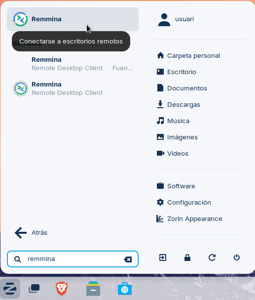
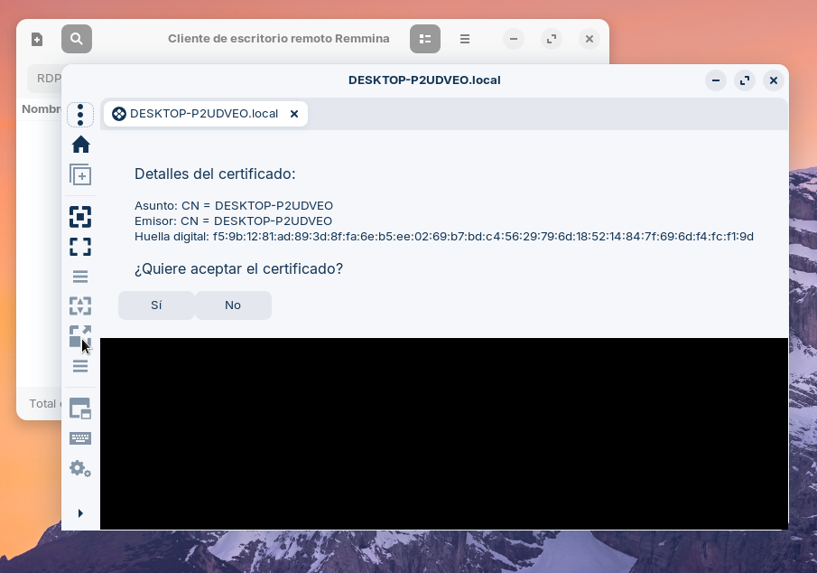
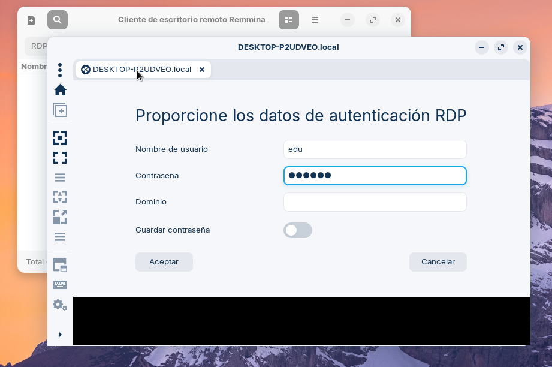
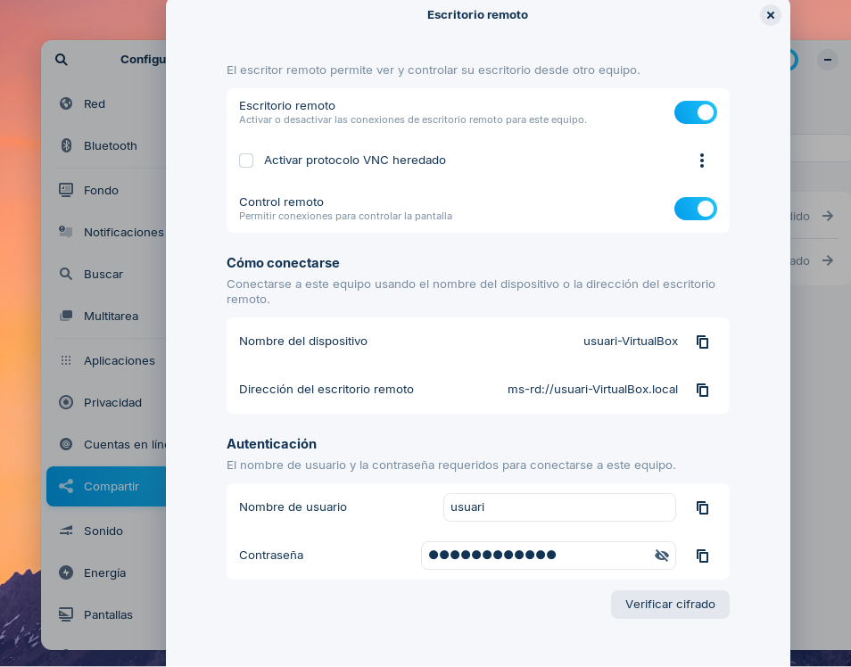
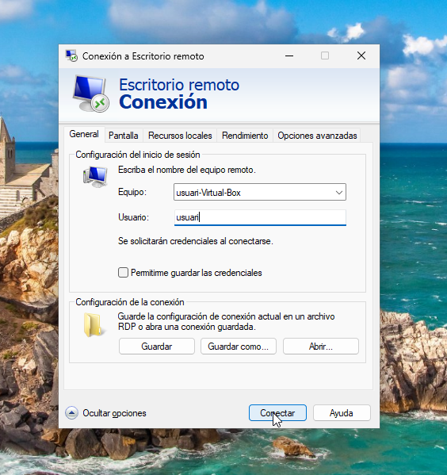

# T06: Accés remot. Escriptori remot (RDP) 
## Projecte 4 | Xarxes Locals
### Edu Gordo | SMX 2A

Habilitem l'escriptori remot des de la configuració de Windows

---

Hauría de quedar tal que aixi amb l'escriptori remot habilitat i el port de l'escriptori remot

---

Anem a l'apartat de "usuaris de escriptori remot" i afegim un usuari nou

---

Creem l'usuari, li posem el nom que vulguem i li donem a acceptar

---

I ja tindriem l'usuari creat en l'escriptori remot

---

Ara anirem a la màquina de Zorin OS i entrarem a "Remmina"

---

Buscarem el nom del dispositiu Windows per poder connectar-nos

---

Quan ens connectem, introduirem el nom de l'usuari que hem creat en el escritori remot de Windows i posarem la contrasenya de l'usuari

---

I podrem veure la pantalla del dispositiu de Windows, la del client

---

Ara anirem a la configuració de Zorin i entrarem en l'apartat de "compartir". Seguidament, activarem l'opció de "escritori remot". I ens donarà unes dades del propi dispositiu

---

A Windows, el que haurem de fer es buscar a la barra de tasques; "Conexió a Escritorio Remoto". S'ens obrirà una pantalla on haurem de posar les dades que ens posava en la màquina virtual de Zorin OS

---

Ens demanarà la contrasenya que ens indicava la configuració de Zorin OS

---

I podrem veure la pantalla del dispositiu de Zorin des de Windows

---
