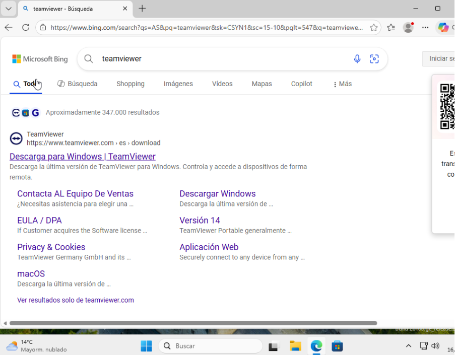
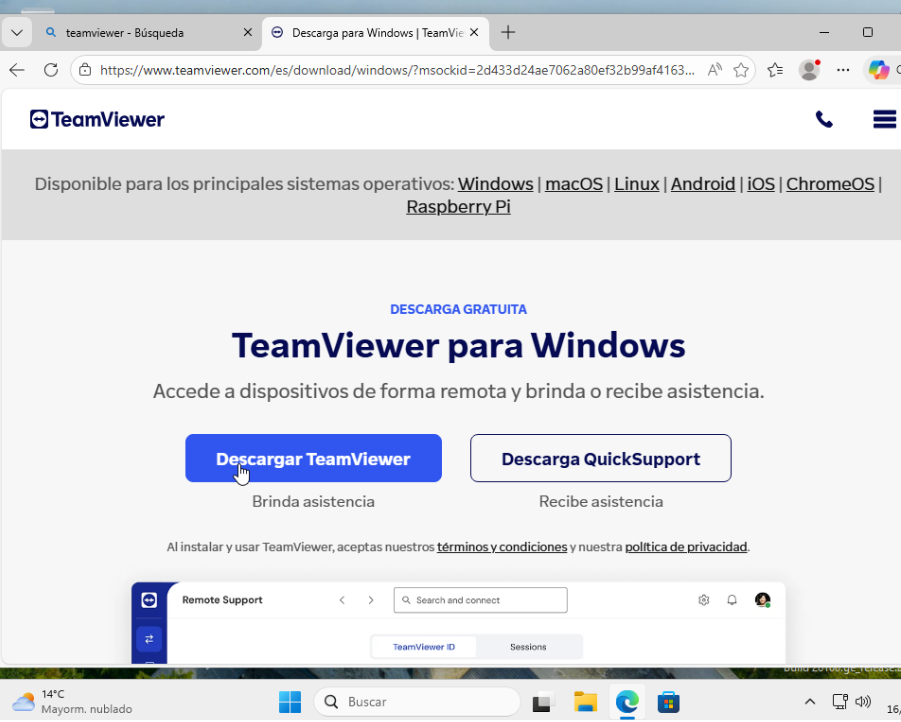
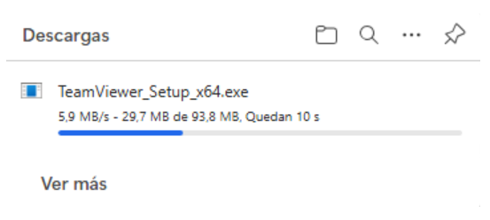
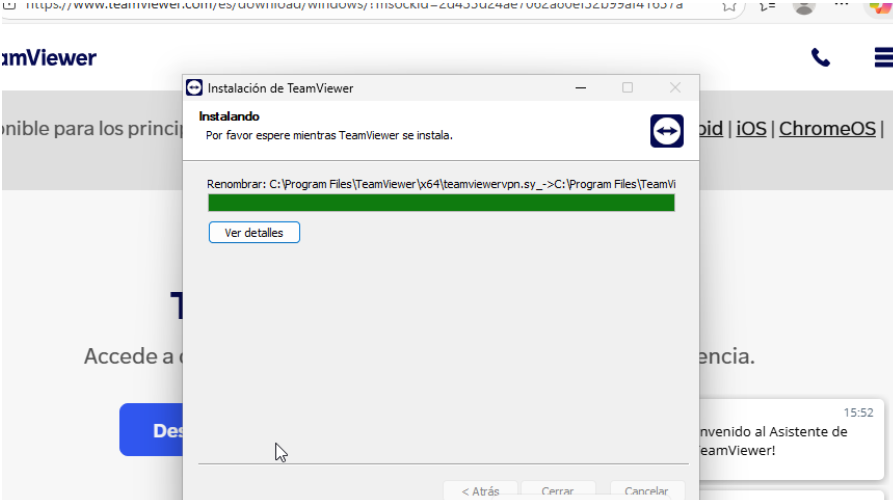
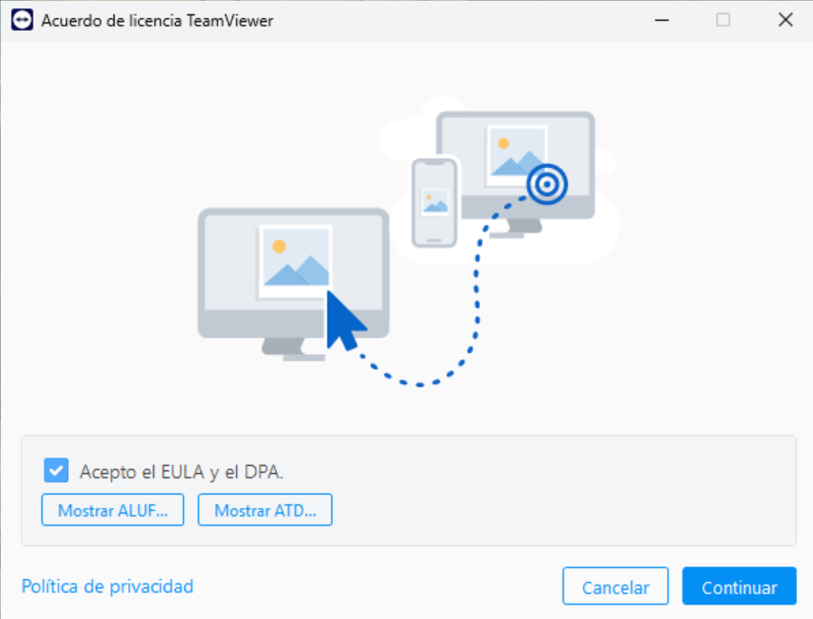
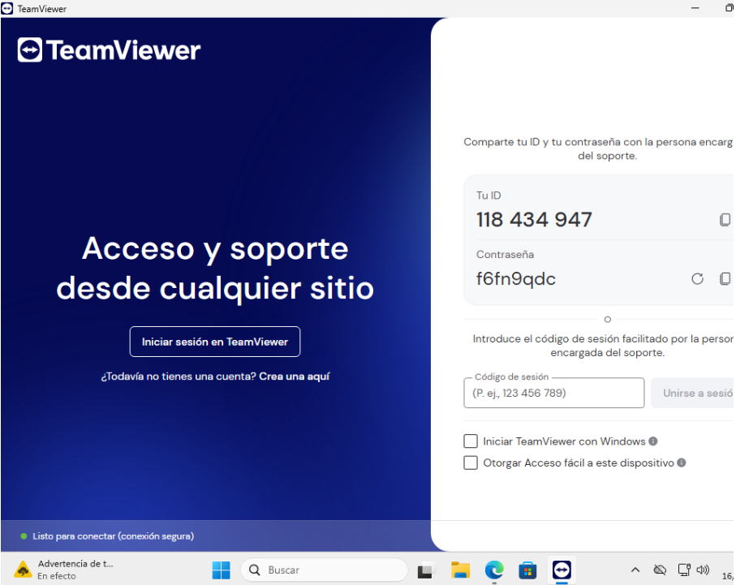
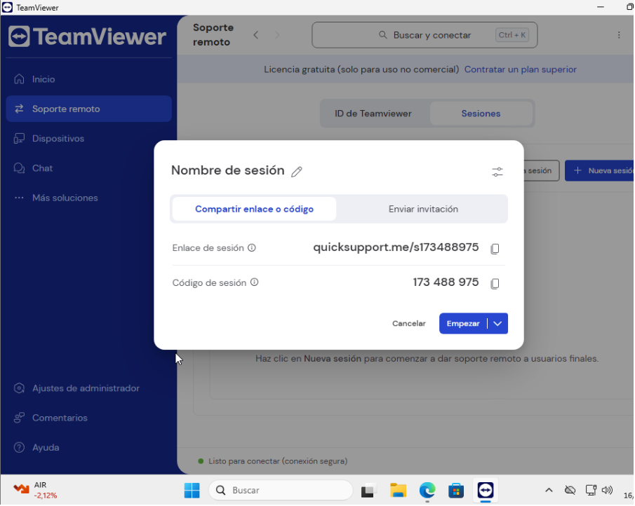

# T07: Accés remot. Serveis d’assistència remota
## Projecte 4: EverPia III
### Edu Gordo | SMX 2A

---

Busquem TeamViewer des de qualsevol navegador per poder accedir remotament al client

---

El descarreguem des de la pagina web oficial

---

Esperem a que es completi la baixada

---

Acceptem i continuem per instal·lar-lo

---

Acceptem els acodrs i les condicions i continuem

---

Quan estiguem en la pantalla principal de l'aplicació, el que haurem de fer es crear un compte, en el cas que el tinguem, iniciarem sessió directament

---

Aixì entrarem en la pagina principal del nostre usuari

---

Quan estiguem en el menú, anirem a l'esquerra en l'apartat de "Suport Remot" i sel·leccionarem l'opció de "Unir-se a una sessió

---

Per unir-nos a uan sessió, haurem d'introduir el codi que ens doni la persona que es vulgui connectar a nosaltres. Seguidament haurem de verificar a l'usuari que vulguem donar-li permis per accedir al nostre dispositiu remotament

---

I com podem veure, el usuari que és volia connectar al nostre dispositiu ja ho pot fer sense cap problema i pot controlar el nostre dispositiu remotament 

(Aquesta practica està fet amb un company de classe, per aixó el seu nom en l'última imatge "Abdeslam Khfif Koubee")

