# T09 - Servidor NFS
## Projecte 4 - EverPia III
### Edu Gordo | SMX 2A

---
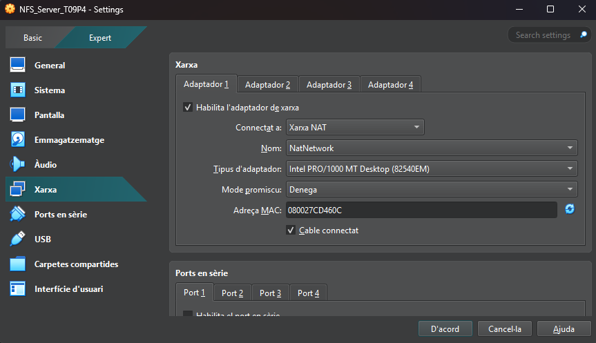
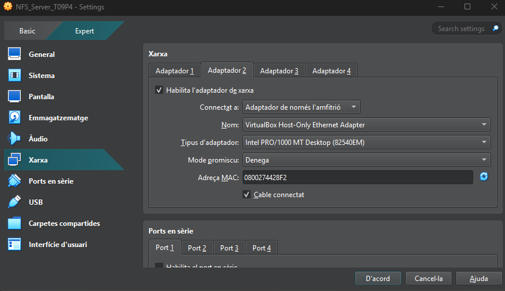
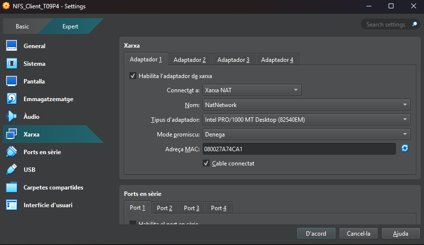
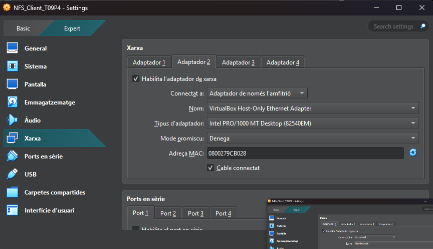

Aquest son els adaptadors que utilitzarme tan el el servidor com en el client per poder lograr la connexió entre els dos via SSH

---

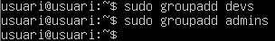

Creem els grups "devs" i "admins"

```
sudo groupadd devs
```
```
sudo groupadd admins
```
---

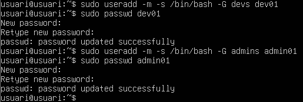

També creem un usuari per cada grup i li posem una contrasenya a cada usuari

```
sudo useradd -m -s /bin/bash -G devs dev01
```
```
sudo passwd dev01
```
```
sudo useradd -m -s /bin/bash -G admins admin01
```
```
sudo passwd admin01
```

---

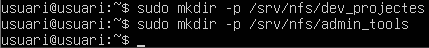

Creem les carpetes "dev_projects" i "admin_tools" dins del directori /srv/nfs/

```
sudo mkdir -p /srv/nfs/dev_projects
```
```
sudo mkdir -p /srv/nfs/admin_tools
```

---

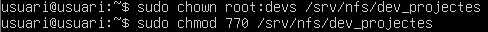

Fem que la carpeta "devs" pertanyi al *root* i apliquem els permisos amb la segona comanda

```
sudo chown root:devs /srv/nfs/dev_projects
```
```
sudo chmod 770 /srv/nfs/dev_projects
```

---


Fem el mateix que hem fet amb el grup "devs" pero aquesta vegada amb la carpeta "admins". Utilitzem les mateixes dos comandes pero canviant el nom del grup

```
sudo chown root:admins /srv/nfs/admin_tools
```
```
sudo chmod 770 /srv/nfs/admin_tools
```

---

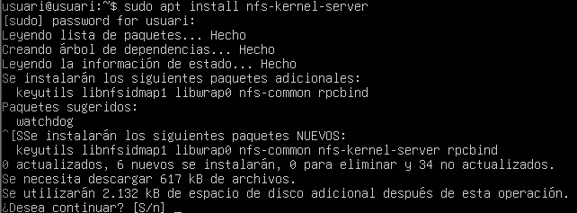

Instal·lem el servei NFS amb la següent comanda

```
sudo apt install nfs-kernel-server
```

---

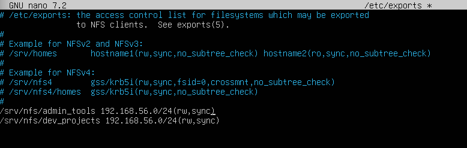

Editem el fitxer de **etc/exports** i afegim aquestes dues linies per compartir els directoris amb tota l'adreça IP que li assignem en la linia 

```
sudo nano /etc/exports
```

`/srv/nfs/admin_tools 192.168.56.0/24(rw,sync)`

`/srv/nfs/dev_projects 192.168.56.0/24(rw,sync)`

---

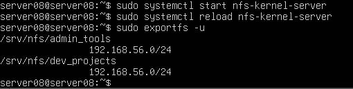

Guardem els canvis del fitxer que hem editat anteriorment i iniciem el servei de NFS, després el tornem a recarregar amb la segona comanda i per últim desactivem totes les carpetes compartides del servidor. Aquest últim pas és molt útil si és necessit solucionar algun problema o fer algun canvi sense haver de reiniicar tot el servidor

```
sudo systemctl start nfs-kernel-server
```

```
sudo systemctl reload nfs-kernel-server
```

```
sudo exportfs -u
```

---

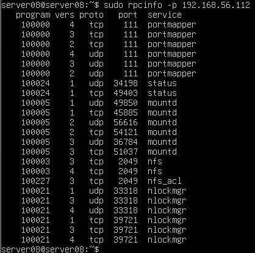

Amb aquesta comanda el que fa es mostrar tots els serveis RCP que estan funcionant ei el port on estan assignats

```
sudo rpcinfo -p 192.168.56.112
```

---

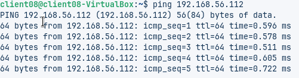

Passem al client i el primer que farem es comprovar que tenim acces a internet a traves de la IP del servidor

```
ping 192.168.56.112
```

---

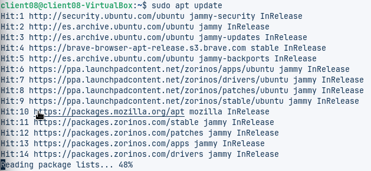

Actualitzarem el sistema a la versió més recent

```
sudo apt update
```

---

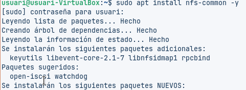

Instal·lem el servei nfs

```
sudo apt install nfs-common -y
```

---

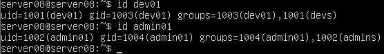
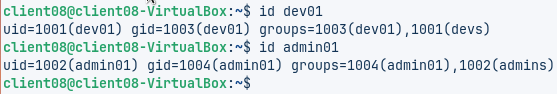

Aqui podem veure que, quan hem creat els grups i els usuaris en el client, automaticamanet s'han assignat els mateixos valors UID i GID que en el servidor tant per l'usuari com el grup que pertany

```
id dev01
```
```
id admin01
```

---

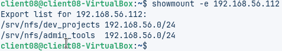

Amb aquesta comanda podem veure les carpetes que s'estàn compartint des de la IP 192.168.56.112

```
showmount - 192.168.56.112
```

---

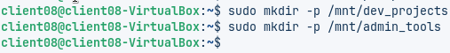

Creem les carpetes en el client

```
sudo mkdir -p /mnt/dev_projects
```

```
sudo mkdir -p /mnt/admin_tools
```

---

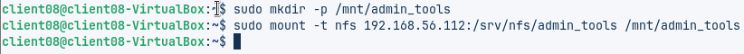

Muntem el directori del servidor dins del directori del client

```
sudo mkdir -p /mnt/admin_tools
```

```
sudo mount -t nfs 192.168.56.112:/srv/nfs/admin_tools /mnt/admin_tools
```

---


Creem un fitxer buit dins del directori de "admin_tools"

```
sudo touch /mnt/admin_tools/test01.txt
```

---

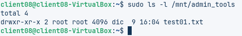

Aquesta comanda mostra la llista de fitxers i directoris dins de */mnt/admin_tools* amb els detalls de permisos, propietari i grup.


```
sudo ls -l /mnt/admin_tools
```

---

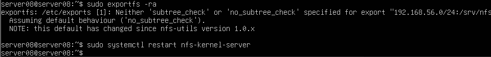

Tornem a iniciar les carpetes que estava compartint el servidor i reiniciem el servei NFS

```
sudo exportfs -ra
```

```
sudo systemctl restart nfs-kernel-server
```

---

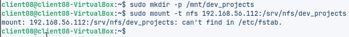

Fem el mateix que emab la carpeta "admin_tools" amb la carpeta "dev_projects", muntem el directori en el directori del servidor

```
sudo mkdir -p /mnt/dev_projects
```

```
sudo mount -t nfs 192.168.56.112:/srv/nfs/dev_projects
```

---

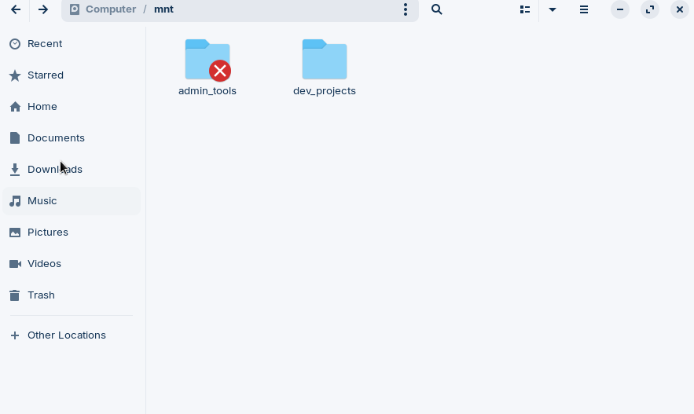

Com podem veure les carpetes estan creades i la **X** que surt ens indica que tenen contrasenya. (Les dues carpetes tenen contrasenya, el que passa és que ja havia introduit la contrasenya d'una d'elles i va deixar de surtir la creu)

---

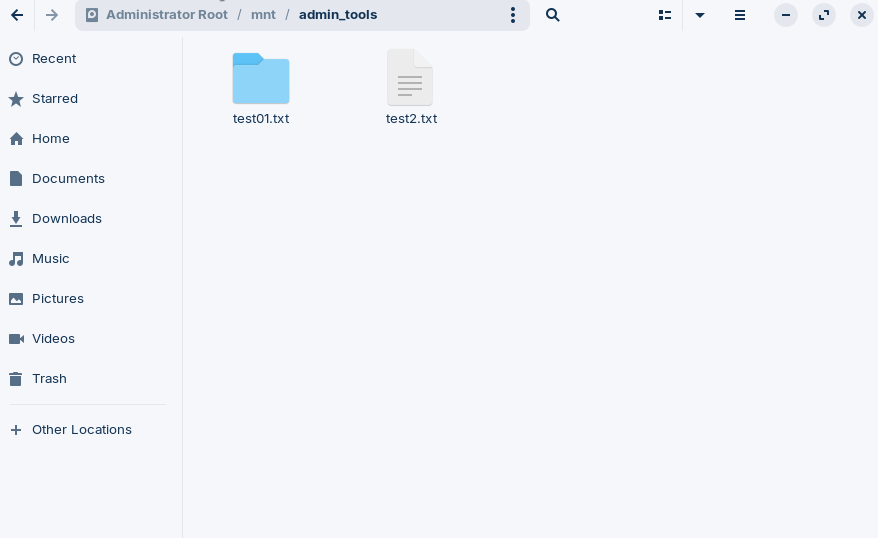

I dins de la carpeta admin_tools tenim el fitxer buit que hem creat anteriorment

---

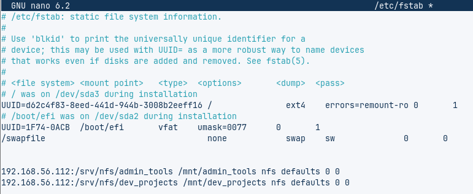

Editem el fitxer de **/etc/fstab** en el client perque el directori del client es monti automaticament en el directori del servidor

```
sudo nano /etc/fstab
```
`192.168.56.112:/srv/nfs/admin_tools /mnt/admin_tools nfs default 0 0`

`192.168.56.112:/srv/nfs/dev_projects /mnt/dev_projects nfs default 0 0`

---


Reiniciem la màquina del client

```
sudo reboot
```

---

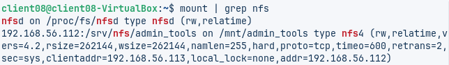

I per ultim, amb la següent comanda veiem quins fitxer NFS del servidor estan muntats en el client

```
mount | grep nfs
```

---
